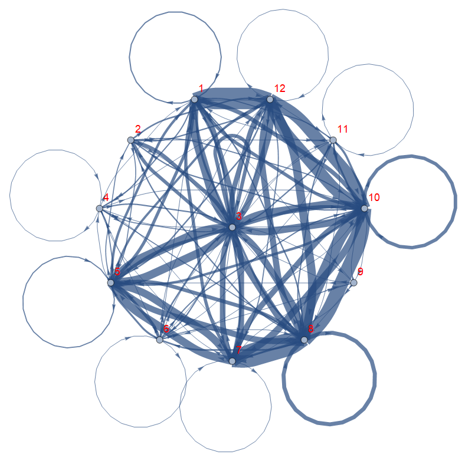

# Visualization:
## Description

Experimental repository for **data visualization**.

---
Objectives:
1. Practice *design* concepts
2. Develop an aesthetic sense for displaying data
3. Enchance explanations by using visual analogies
----

``` python
print("Hello World")
```

